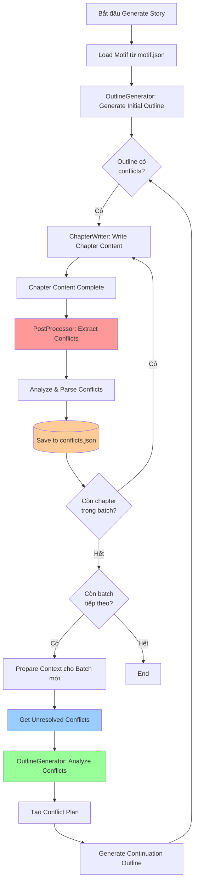
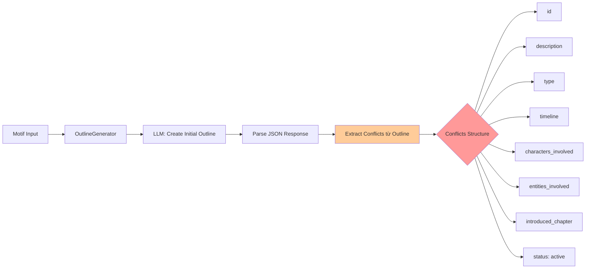
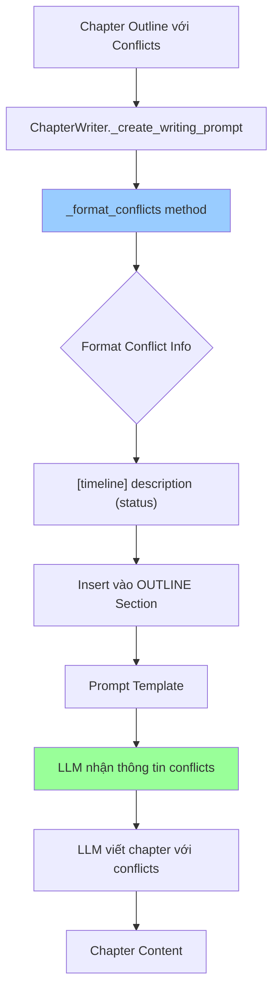
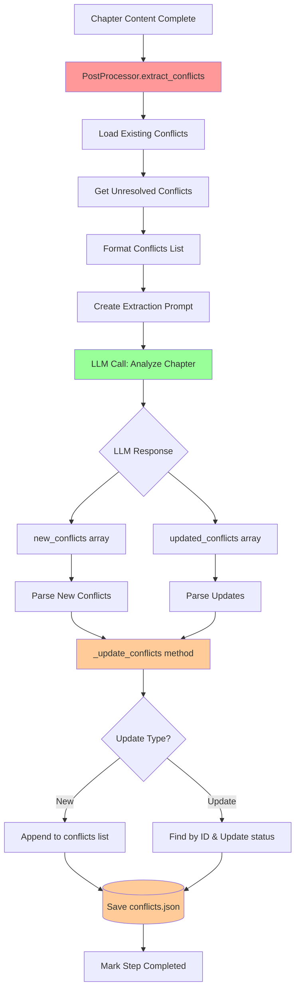
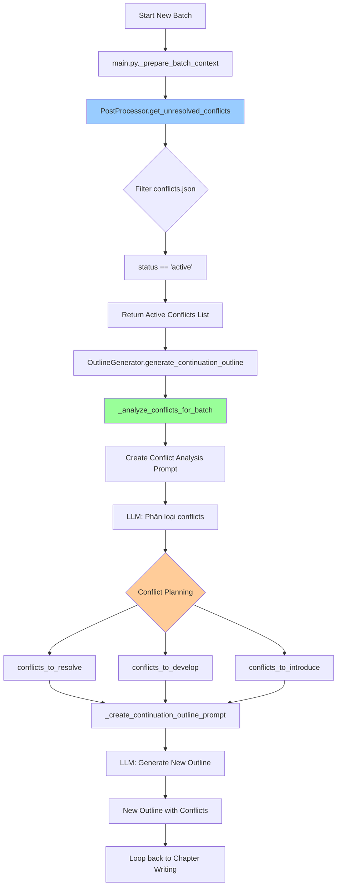
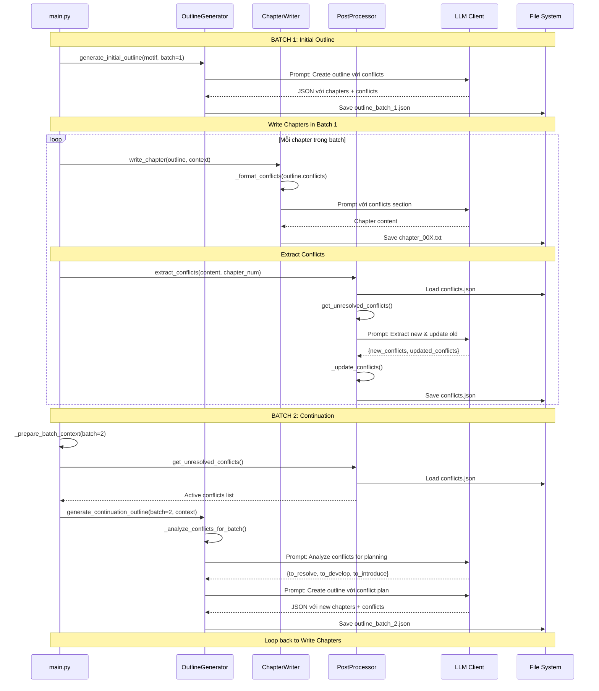

# Sơ Đồ Hệ Thống Conflict Trong Story Writer

## Tổng Quan Luồng Hoạt Động



## Chi Tiết Các Giai Đoạn

### 1. CONFLICT TRONG INITIAL OUTLINE



**Timeline Types:**
- `immediate`: 1 chapter (phải giải quyết ngay)
- `batch`: 5 chapters (trong batch hiện tại)
- `short_term`: 10 chapters
- `medium_term`: 30 chapters
- `long_term`: 100 chapters
- `epic`: 300 chapters

### 2. CONFLICT TRONG CHAPTER WRITING



**Format trong Prompt:**
```
Mâu thuẫn:
- [batch] Lăng Thiên cần tìm cách khắc chế độc tố trong cơ thể (trạng thái: active)
- [short_term] Xung đột với gia tộc Liễu về quyền thừa kế (trạng thái: developing)
```

### 3. EXTRACT CONFLICTS SAU KHI VIẾT CHAPTER



**LLM Extraction Prompt Structure:**
```python
"""
Hãy trích xuất các mâu thuẫn từ chương {chapter_num}.

**NỘI DUNG CHƯƠNG:**
{chapter_content}

**MÂU THUẪN ĐÃ CÓ:**
{formatted_unresolved_conflicts}

**YÊU CẦU:**
1. Xác định mâu thuẫn MỚI phát sinh
2. Cập nhật trạng thái mâu thuẫn cũ (nếu có tiến triển/giải quyết)
3. Phân loại timeline

**OUTPUT JSON:**
{
  "new_conflicts": [...],
  "updated_conflicts": [...]
}
"""
```

### 4. SỬ DỤNG CONFLICTS CHO BATCH TIẾP THEO



**Conflict Planning Logic:**
```python
# NGUYÊN TẮC XẾP LOẠI:
- immediate (1 chapter): BẮT BUỘC giải quyết ngay
- batch (5 chapters): ƯU TIÊN giải quyết trong batch này
- short_term (10 chapters): CÓ THỂ bắt đầu giải quyết hoặc tiếp tục phát triển
- medium_term (30 chapters): PHÁT TRIỂN thêm, không giải quyết
- long_term/epic: CHỈ DUY TRÌ, không tập trung
```

## Cấu Trúc Dữ Liệu Conflict

### Trong Outline JSON

```json
{
  "chapters": [
    {
      "chapter_number": 1,
      "conflicts": [
        {
          "id": "conflict_ch1_0",
          "description": "Lăng Thiên bị trúng độc Cửu Chuyển Phệ Hồn Tán, cần tìm cách giải độc",
          "type": "external",
          "timeline": "batch",
          "characters_involved": ["Lăng Thiên"],
          "entities_involved": ["Cửu Chuyển Phệ Hồn Tán"],
          "introduced_chapter": 1,
          "status": "active"
        }
      ]
    }
  ]
}
```

### Trong conflicts.json

```json
[
  {
    "id": "conflict_ch1_0",
    "description": "Lăng Thiên bị trúng độc Cửu Chuyển Phệ Hồn Tán, cần tìm cách giải độc",
    "type": "external",
    "timeline": "batch",
    "characters_involved": ["Lăng Thiên"],
    "entities_involved": ["Cửu Chuyển Phệ Hồn Tán"],
    "introduced_chapter": 1,
    "status": "active"
  },
  {
    "id": "conflict_ch3_1",
    "description": "Xung đột với gia tộc Liễu về quyền thừa kế",
    "type": "external",
    "timeline": "short_term",
    "characters_involved": ["Lăng Thiên", "Liễu Như Yên"],
    "entities_involved": ["Gia tộc Liễu"],
    "introduced_chapter": 3,
    "status": "developing",
    "resolution_chapter": null
  },
  {
    "id": "conflict_ch2_0",
    "description": "Nội tâm mâu thuẫn về việc lợi dụng kiến thức kiếp trước",
    "type": "internal",
    "timeline": "medium_term",
    "characters_involved": ["Lăng Thiên"],
    "entities_involved": [],
    "introduced_chapter": 2,
    "status": "resolved",
    "resolution_chapter": 8
  }
]
```

## Các Method Liên Quan Đến Conflict

### PostChapterProcessor

```python
class PostChapterProcessor:
    
    # 1. Extract conflicts từ chapter content
    def extract_conflicts(chapter_content, chapter_num) -> List[Dict]:
        """Gọi LLM để trích xuất conflicts mới và cập nhật cũ"""
        
    # 2. Get active conflicts
    def get_unresolved_conflicts() -> List[Dict]:
        """Return conflicts có status == 'active'"""
        
    # 3. Get conflicts by timeline
    def get_conflicts_by_timeline(timeline: str) -> List[Dict]:
        """Filter conflicts theo timeline (batch, short_term, etc.)"""
    
    # 4. Internal helpers
    def _parse_conflicts_response(response, chapter_num):
        """Parse LLM JSON response thành new_conflicts và updated_conflicts"""
        
    def _update_conflicts(new_conflicts, updated, chapter_num):
        """
        - Add new conflicts to list
        - Update existing conflicts by ID
        - Save to conflicts.json
        """
    
    def _format_conflicts_list(conflicts) -> str:
        """Format conflicts cho prompt"""
        # Output: "- [timeline] description (ID: xxx)"
```

### ChapterWriter

```python
class ChapterWriter:
    
    def _format_conflicts(conflicts: List[Dict]) -> str:
        """
        Format conflicts từ outline để insert vào prompt
        
        Output:
        - [batch] Lăng Thiên cần tìm cách khắc chế độc tố (trạng thái: active)
        - [short_term] Xung đột với gia tộc Liễu (trạng thái: developing)
        """
        return "\n".join([
            f"- [{c.get('timeline', 'unknown')}] {c.get('description', '')} "
            f"(trạng thái: {c.get('status', 'unknown')})"
            for c in conflicts
        ])
```

### OutlineGenerator

```python
class OutlineGenerator:
    
    def _analyze_conflicts_for_batch(batch_num, context) -> Dict:
        """
        Phân tích conflicts để quyết định:
        - Conflicts nào cần resolve trong batch này
        - Conflicts nào tiếp tục develop
        - Conflicts mới nên introduce
        
        Returns:
        {
            'conflicts_to_resolve': [...],
            'conflicts_to_develop': [...],
            'conflicts_to_introduce': [...]
        }
        """
    
    def _create_continuation_outline_prompt(batch_num, context, conflict_plan):
        """
        Tạo prompt cho LLM với conflict plan
        LLM sẽ generate outline dựa trên conflict planning
        """
```

### main.py

```python
class StoryGenerator:
    
    def _prepare_batch_context(batch_num) -> Dict:
        """
        Prepare context cho batch mới:
        1. Get active conflicts
        2. Get related characters/entities from conflicts
        3. Get related events
        
        Returns context dict với active_conflicts
        """
    
    def _select_conflicts_for_batch(batch_num, all_conflicts) -> List:
        """
        Select conflicts dựa trên priority:
        - immediate: bắt buộc
        - batch: ưu tiên
        - short_term: một số
        - medium/long_term: awareness
        """
```

## Luồng Dữ Liệu Đầy Đủ



## Ví Dụ Thực Tế

### Ví Dụ 1: Conflict Lifecycle

#### Chapter 1: Introduce
```json
{
  "id": "conflict_poison",
  "description": "Lăng Thiên bị trúng độc Cửu Chuyển Phệ Hồn Tán",
  "timeline": "batch",
  "introduced_chapter": 1,
  "status": "active"
}
```

#### Chapter 2-4: Developing
- Chapter 2: Lăng Thiên tìm kiếm thông tin về loại độc này
- Chapter 3: Phát hiện manh mối về Bạch Ngọc Lan
- Chapter 4: Tìm được Bạch Ngọc Lan nhưng cần chế thuốc

Status vẫn là `active`, không có `resolution_chapter`

#### Chapter 5: Resolve
```json
{
  "id": "conflict_poison",
  "description": "Lăng Thiên bị trúng độc Cửu Chuyển Phệ Hồn Tán",
  "timeline": "batch",
  "introduced_chapter": 1,
  "status": "resolved",
  "resolution_chapter": 5
}
```

### Ví Dụ 2: Multiple Timelines

**Batch 1 (Chapters 1-5):**

```python
conflicts = [
    {
        "id": "c1",
        "description": "Độc tố cần giải quyết gấp",
        "timeline": "immediate",  # Must resolve in chapter 2
        "status": "active"
    },
    {
        "id": "c2", 
        "description": "Tìm kiếm võ công phù hợp",
        "timeline": "batch",  # Resolve trong 5 chapters
        "status": "active"
    },
    {
        "id": "c3",
        "description": "Xây dựng nền tảng tu luyện",
        "timeline": "short_term",  # 10 chapters
        "status": "active"
    },
    {
        "id": "c4",
        "description": "Khôi phục đỉnh cao kiếp trước",
        "timeline": "long_term",  # 100 chapters
        "status": "active"
    }
]
```

**Batch 2 Analysis:**
```python
conflict_plan = {
    "conflicts_to_resolve": ["c2"],  # Batch timeline đã hết
    "conflicts_to_develop": ["c3"],  # Short-term tiếp tục
    "conflicts_to_introduce": [
        "Conflict với môn phái mới",
        "Phát hiện bí mật gia tộc"
    ]
}
```

## File Locations

```
projects/story_001/
├── outputs/
│   ├── conflicts/
│   │   └── conflicts.json          ← All conflicts storage
│   ├── outlines/
│   │   ├── batch_1_outline.json    ← Conflicts in outline
│   │   └── batch_2_outline.json
│   └── chapters/
│       ├── chapter_001.txt         ← Generated with conflicts context
│       └── chapter_002.txt
```

## Key Features

### 1. **Conflict Tracking**
- Mỗi conflict có ID unique để track qua nhiều chapters
- Status tracking: `active` → `developing` → `resolved`
- Resolution chapter được ghi nhận

### 2. **Timeline Management**
- 6 timeline levels từ immediate đến epic
- Giúp prioritize conflicts cần resolve
- Prevent conflicts bị quên hoặc resolve quá sớm/muộn

### 3. **Context Propagation**
- Conflicts từ outline → chapter writing prompt
- Extracted conflicts → next batch context
- Unresolved conflicts → conflict planning

### 4. **LLM-Driven Analysis**
- LLM extract conflicts từ chapter content
- LLM analyze và plan conflict resolution
- LLM update conflict status

### 5. **Data Persistence**
- conflicts.json lưu trữ tất cả conflicts
- Checkpoint system track extraction steps
- Không mất data khi restart

## Summary

Hệ thống conflict hoạt động theo vòng lặp:

1. **Outline** → Conflicts được define với timeline
2. **Writing** → Conflicts xuất hiện trong prompt để guide LLM
3. **Extraction** → LLM extract conflicts mới và update cũ từ content
4. **Storage** → Save vào conflicts.json
5. **Analysis** → Analyze unresolved conflicts cho batch tiếp theo
6. **Planning** → Quyết định conflicts nào resolve/develop
7. **Loop** → Quay lại bước 1 với context mới

Điều này đảm bảo:
- ✅ Conflicts được track consistently
- ✅ Không bị quên hoặc drop conflicts
- ✅ Resolution có kế hoạch rõ ràng
- ✅ Story có tension và structure tốt
