# Sơ Đồ Conflict System - Quick Reference

## Tổng Quan Nhanh

```
┌─────────────────────────────────────────────────────────────────┐
│                    CONFLICT LIFECYCLE                            │
├─────────────────────────────────────────────────────────────────┤
│                                                                  │
│  1. DEFINE in Outline → 2. USE in Writing → 3. EXTRACT → 4. PLAN │
│                                                                  │
│  OutlineGenerator    ChapterWriter      PostProcessor   Next    │
│        ↓                  ↓                  ↓           Batch   │
│   [conflicts]      [prompt format]    [conflicts.json]    ↓     │
│   in outline           section         storage         [loop]    │
│                                                                  │
└─────────────────────────────────────────────────────────────────┘
```

## 4 Bước Chính

### 🔵 Bước 1: DEFINE Conflicts (OutlineGenerator)

**Input:** Motif hoặc context từ batch trước  
**Process:** LLM tạo outline với conflicts  
**Output:** Outline JSON có conflicts array

```python
chapter_outline = {
    "conflicts": [
        {
            "id": "conflict_ch1_0",
            "description": "Lăng Thiên bị trúng độc",
            "timeline": "batch",  # 5 chapters
            "status": "active"
        }
    ]
}
```

### 🟢 Bước 2: USE Conflicts (ChapterWriter)

**Input:** Chapter outline với conflicts  
**Process:** Format conflicts vào prompt  
**Output:** LLM nhận context và viết chapter

```
Prompt gửi cho LLM:
┌────────────────────────────────┐
│ OUTLINE CHƯƠNG 1               │
│                                │
│ Mâu thuẫn:                     │
│ - [batch] Lăng Thiên bị trúng  │
│   độc (trạng thái: active)     │ ← Conflicts được format
│                                │
│ Địa điểm: ...                  │
└────────────────────────────────┘
```

### 🟡 Bước 3: EXTRACT Conflicts (PostProcessor)

**Input:** Chapter content vừa viết  
**Process:** LLM analyze và extract conflicts  
**Output:** Update conflicts.json

```python
# LLM trả về:
{
    "new_conflicts": [
        {
            "id": "conflict_ch1_1",
            "description": "Phát hiện âm mưu của kẻ hạ độc",
            "timeline": "short_term"
        }
    ],
    "updated_conflicts": [
        {
            "id": "conflict_ch1_0",
            "status": "developing"  # Update status
        }
    ]
}
```

### 🔴 Bước 4: PLAN Conflicts (Next Batch)

**Input:** Unresolved conflicts từ conflicts.json  
**Process:** Analyze để quyết định resolve/develop  
**Output:** Conflict plan cho outline mới

```python
conflict_plan = {
    "conflicts_to_resolve": ["conflict_ch1_0"],  # Giải quyết
    "conflicts_to_develop": ["conflict_ch1_1"],  # Tiếp tục phát triển
    "conflicts_to_introduce": [...]              # Conflicts mới
}
```

→ **Loop lại Bước 1** với conflict plan

---

## Timeline Hierarchy

```
immediate     ████                    (1 chapter)   → MUST resolve
batch         ████████                (5 chapters)  → SHOULD resolve
short_term    ████████████            (10 chapters) → CAN resolve
medium_term   ████████████████████    (30 chapters) → DEVELOP
long_term     ████████████████████... (100 chapters)→ MAINTAIN
epic          ...                     (300 chapters)→ MAINTAIN
```

---

## Data Flow Diagram

```mermaid
graph LR
    A[Motif/Context] --> B[OutlineGenerator]
    B --> C[outline.json<br/>with conflicts]
    
    C --> D[ChapterWriter]
    D --> E[_format_conflicts]
    E --> F[Prompt with<br/>conflicts section]
    
    F --> G[LLM writes<br/>chapter]
    G --> H[chapter.txt]
    
    H --> I[PostProcessor]
    I --> J[extract_conflicts]
    J --> K[conflicts.json]
    
    K --> L[get_unresolved_<br/>conflicts]
    L --> M[Next Batch<br/>Context]
    M --> B
    
    style B fill:#99ccff
    style I fill:#ff9999
    style K fill:#ffcc99
```



---

## File Structure

```
projects/story_001/
├── outputs/
│   ├── outlines/
│   │   └── batch_1_outline.json
│   │       {
│   │         "chapters": [{
│   │           "conflicts": [...]  ← DEFINE
│   │         }]
│   │       }
│   │
│   ├── chapters/
│   │   └── chapter_001.txt         ← USE (written with conflicts context)
│   │
│   └── conflicts/
│       └── conflicts.json           ← EXTRACT & STORAGE
│           [
│             {
│               "id": "conflict_ch1_0",
│               "status": "active",
│               ...
│             }
│           ]
```

---

## Key Methods

```python
# PostChapterProcessor
post_processor.extract_conflicts(content, chapter_num)
    → Parse chapter, extract new conflicts, update old ones
    
post_processor.get_unresolved_conflicts()
    → Return conflicts với status == 'active'
    
post_processor.get_conflicts_by_timeline(timeline)
    → Filter conflicts theo timeline

# ChapterWriter  
chapter_writer._format_conflicts(conflicts)
    → Format: "- [timeline] description (status)"
    
# OutlineGenerator
outline_generator._analyze_conflicts_for_batch(batch_num, context)
    → Analyze conflicts, quyết định resolve/develop
```

---

## Status Transitions

```
┌──────────┐
│  ACTIVE  │ ← Conflict mới được introduce
└────┬─────┘
     │
     ├─→ DEVELOPING ← Conflict đang được phát triển
     │
     └─→ RESOLVED   ← Conflict đã được giải quyết
         (có resolution_chapter)
```

---

## Example: Poison Conflict

### Chapter 1: Introduce
```json
{
  "id": "poison_conflict",
  "description": "Trúng độc Cửu Chuyển Phệ Hồn Tán",
  "timeline": "batch",
  "status": "active",
  "introduced_chapter": 1
}
```

### Chapter 2-4: Developing
- Tìm thông tin về độc tố
- Phát hiện Bạch Ngọc Lan
- Thu thập nguyên liệu

```json
{
  "id": "poison_conflict",
  "status": "developing"  ← Updated
}
```

### Chapter 5: Resolved
```json
{
  "id": "poison_conflict",
  "status": "resolved",
  "resolution_chapter": 5  ← Marked complete
}
```

---

## Priority Selection for Batch

```python
def _select_conflicts_for_batch(all_conflicts):
    selected = []
    
    # 1. MUST include immediate
    selected += [c for c in all_conflicts if c['timeline'] == 'immediate']
    
    # 2. SHOULD include batch
    selected += [c for c in all_conflicts if c['timeline'] == 'batch']
    
    # 3. CAN include some short_term
    selected += [c for c in all_conflicts if c['timeline'] == 'short_term'][:2]
    
    # 4. AWARENESS of medium/long
    # (mentioned but not main focus)
    
    return selected
```

---

## Common Patterns

### Pattern 1: Cascading Conflicts
```
Main Conflict: Trúng độc (batch)
  ├─→ Sub: Tìm nguyên liệu (immediate)
  ├─→ Sub: Chế thuốc giải độc (immediate)
  └─→ Sub: Tìm kẻ hạ độc (short_term)
```

### Pattern 2: Parallel Conflicts
```
Conflict A: Tu luyện (short_term)
Conflict B: Xung đột gia tộc (batch)
Conflict C: Báo thù (long_term)
```

### Pattern 3: Evolving Conflicts
```
Chapter 1: Simple conflict → "Cần tiền"
Chapter 5: Evolved → "Xung đột với thương hội"
Chapter 20: Major → "Chiến tranh kinh tế"
```

---

## Summary

| Phase | Component | Input | Output | Storage |
|-------|-----------|-------|--------|---------|
| **Define** | OutlineGenerator | Motif/Context | Outline JSON | outline_batch_N.json |
| **Use** | ChapterWriter | Outline conflicts | Formatted prompt | - |
| **Extract** | PostProcessor | Chapter content | New/Updated conflicts | conflicts.json |
| **Plan** | OutlineGenerator | Unresolved conflicts | Conflict plan | - |

**Cycle:** Define → Use → Extract → Plan → Define → ...

---

## Quick Commands

```bash
# View all conflicts
cat projects/story_001/outputs/conflicts/conflicts.json | jq '.'

# Count active conflicts
cat projects/story_001/outputs/conflicts/conflicts.json | jq '[.[] | select(.status=="active")] | length'

# View conflicts by timeline
cat projects/story_001/outputs/conflicts/conflicts.json | jq '[.[] | select(.timeline=="batch")]'

# View resolved conflicts
cat projects/story_001/outputs/conflicts/conflicts.json | jq '[.[] | select(.status=="resolved")]'
```
